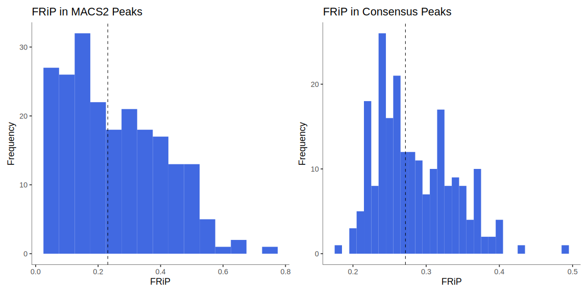
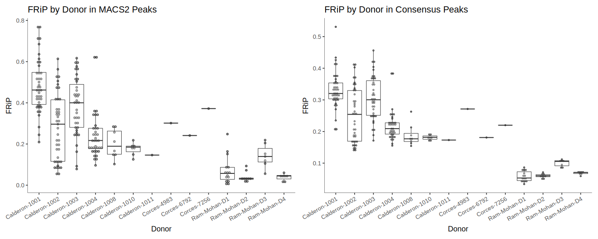
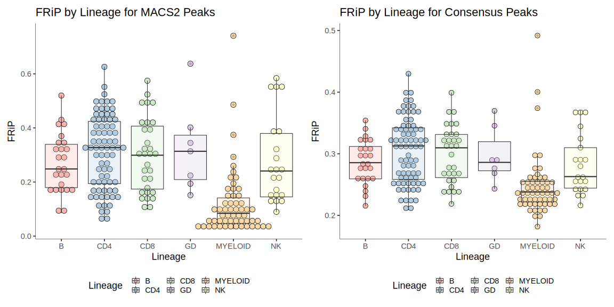
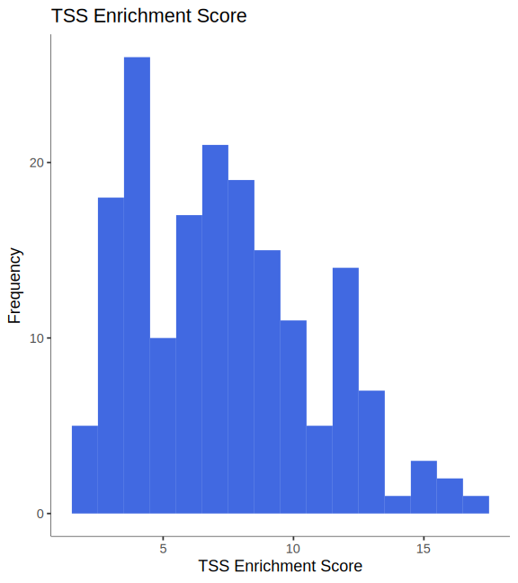
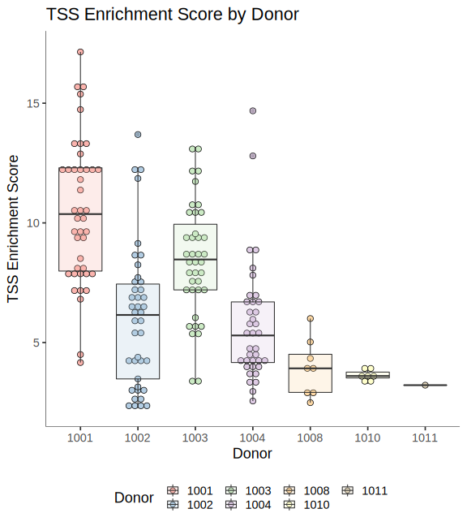
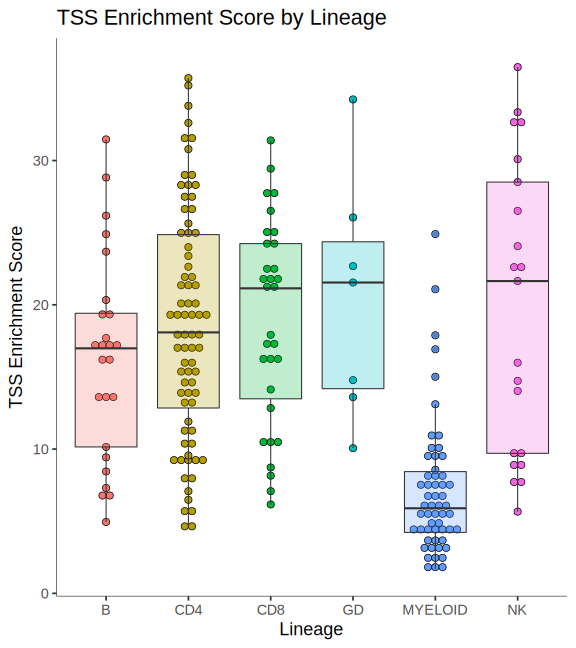
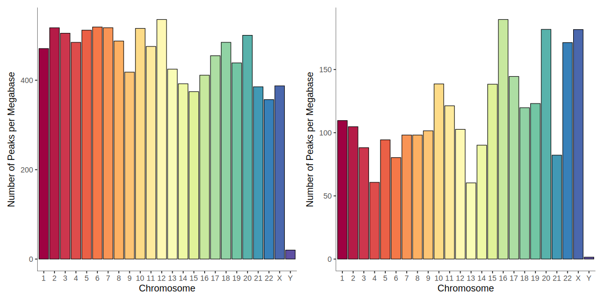
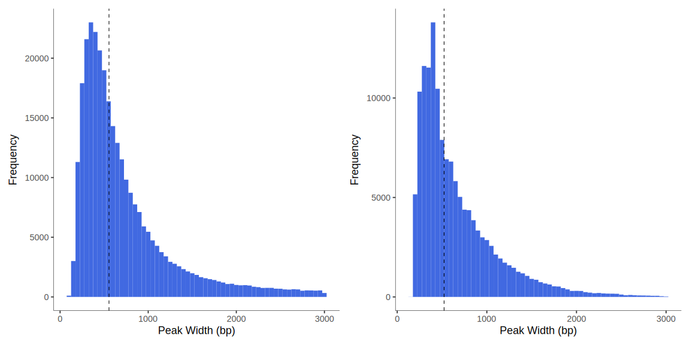
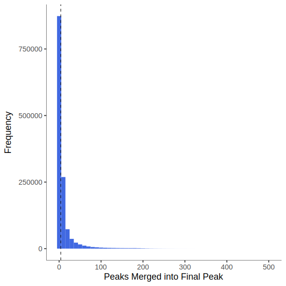
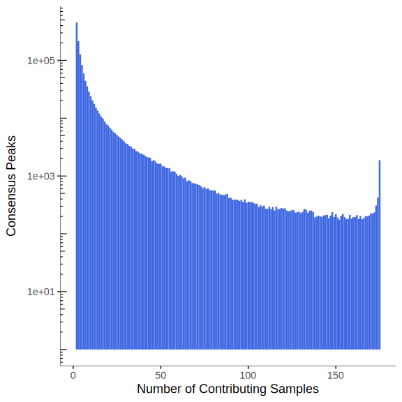

# Immune and Neutrophil Atlases

## Datasets Included

1. [Calderon *et al.* 2019](https://doi.org/10.1038/s41588-019-0505-9)
2. [Ram-Mohan *et al.* 2021](https://doi.org/10.26508/lsa.202000976)

## Calderon *et al.* 2019

The Calderon *et al.* study generated an atlas of transcriptomic and chromatin
accessibility data for primary immune cell types in the blood under both
unstimulated and stimulated conditions.

While 147 of the 166 RNA-Seq samples were run on an Illumina NovaSeq 6000
sequencer with 100 bp paired-end reads, 19 samples were run on an Illumina 
HiSeq 4000 sequencer with 76 bp paired-end reads.

Although there are 25 cell types present in the RNA-Seq samples, only 21 cell
types have at least three samples (necessary for statistical tests).

Of the 8 donors for RNA-Seq samples, 4 made outsized contributions.

In the ATAC-Seq data, in contrast, 159 of the 175 samples were run on an
Illumina HiSeq 4000 sequencer and 16 samples were run on an Illumina NovaSeq
6000 sequencer. All sequenced samples generated 76 bp paired-end reads.

Similar to the RNA-Seq data, 4 of the 7 sample donors made outsized
contributions to the ATAC-Seq data.

| Covariate  | RNA-Seq | ATAC-Seq |
|:-----------|--------:|---------:|
| Donor      | 8       | 7        |
| Treatments | 2       | 2        |
| Lineages   | 6       | 6        |
| Cell Types | 25      | 25       |
| Sequencers | 2       | 2        |
| Reads      | Paired  | Paired   |
| Samples    | 166     | 175      |

**Note**: DCs are dendritic cells. pDCs are Plasmacytoid DCs.

| Lineage | Cell Type                | RNA-Seq Samples | ATAC-Seq Samples|
|:--------|:-------------------------|----------------:|----------------:|
| B       | Bulk_B                   | 7               | 7               |
| B       | Mem_B                    | 7               | 8               |
| B       | Naive_B                  | 8               | 7               |
| B       | Plasmoblasts             | 1               | 3               |
| CD8     | CD8pos_T                 | 8               | 7               |
| CD8     | Central_memory_CD8pos_T  | 7               | 8               |
| CD8     | Effector_memory_CD8pos_T | 8               | 8               |
| CD8     | Naive_CD8_T              | 8               | 8               |
| GD      | Gamma_delta_T            | 7               | 7               |
| CD4     | Effector_CD4pos_T        | 8               | 7               |
| CD4     | Follicular_T_Helper      | 8               | 9               |
| CD4     | Memory_Teffs             | 8               | 8               |
| CD4     | Memory_Tregs             | 7               | 8               |
| CD4     | Naive_Teffs              | 10              | 9               |
| CD4     | Regulatory_T             | 7               | 8               |
| CD4     | Th1_precursors           | 8               | 8               |
| CD4     | Th17_precursors          | 8               | 7               |
| CD4     | Th2_precursors           | 8               | 8               |
| CD4     | Naive_Tregs              | 5               | 4               |
| NK      | Immature_NK              | 1               | 5               |
| NK      | Mature_NK                | 10              | 10              |
| NK      | Memory_NK                | 1               | 6               |
| MYELOID | Monocytes                | 12              | 9               |
| MYELOID | Myeloid_DCs              | 3               | 3               |
| MYELOID | pDCs                     | 1               | 3               |

Additional data for monocytes was supplemented from the Corces *et al.* study.
This data included 6 ATAC-Seq samples and 4 RNA-Seq samples from unstimulated
monocytes.

## Ram-Mohan *et al.* 2021

The Ram-Mohan *et al.* study generated an atlas of neutrophil chromatin
accessibility and transcriptomic data under a broad range of sepsis-relevant
stimulations.

In the ATAC-Seq data, all samples were run on an Illumina HiSeq X Ten
sequencer. All sequenced samples generated 150 bp paired-end reads.

There are 76 total ATAC-Seq samples. Each biological replicate has two
technical replicates, resulting in 38 total biological replicates.

There are three parts to the study:

1. *Ex vivo* stimulation of neutrophils with known ligands
2. Whole organism stimulation of neutrophils with varying concentrations of
    *Staphylococcus aureus*
3. Whole organism stimulation of neutrophils for varying time points with
    *Escherichia coli*

**Ex Vivo Stimulation**

The investigators used six stimulations:

| Type of Infection      | Ligand | Receptor  |
|:-----------------------|:-------|:----------|
| Gram + (*S. aureus*)   | LTA    | TLR2      |
| Gram - (*E. coli*)     | LPS    | TLR4      |
| Gram + or -            | FLAG   | TLR5      |
| ssRNA (Influenza, RSV) | R848   | TLR7/TLR8 |
| Fungal (*Candida*)     | BGP    | Dectin-1  |
| Sterile Inflammation   | HMGB1  | TLR4/?    |

The investigators also included control samples. There were a total of four
donors across these six stimulations. Thus, 28 of the 38 samples are from this
experiment.

**S. aureus Stimulation**

The investigators used 10E1, 10E3, and 10E5 *S. aureus* cells as stimulation.
Only 10E3 had two donors, with one donor for 10E1 and 10E5. Both donors also
provided control samples. Thus, 6 of the 38 samples are from this experiment.

**E. coli Stimulation**

The investigators performed ATAC-Seq 1 hour and 4 hours after stimulation with
*E. coli*. Time-matched control samples were also acquired. Only one donor
contributed to this experiment. Thus, 4 of the 38 samples are from this
experiment.

## Quality Control

### RNA-Seq

### ATAC-Seq

1. FASTQ files were downloaded from SRA in paired-end mode
2. Adapter contamination from sequencing was removed from FASTQ files using Trim
    Galore
3. Initial QC was performed on samples using FastQC

One method we used to assess the quality of samples was by measuring the 
fraction of reads in peaks (FRiP). Briefly, peaks were called using the MACS2
software. We created a consensus peak set from the individual peak sets called
for each sample. The FRiP in the consensus peaks was, on average, higher than that for each sample's MACS2 peaks.

We could not discern any strong donor- or lineage-specific quality issues from the FRiP scores.

The authors of the study used TSS Enrichment Scores as a proxy for sample quality. An advantage of this score is that it is independent of the peaks set
used in the final analysis. I calculated this score for our samples.

Some donors do seem to produce better quality ATAC-Seq data. Samples from the monocyte lineage seem to suffer from quality issues in general.

The consensus peak set was generated by combining MACS2 peaks from samples.
Peaks that were present in more than one biological replicate were chosen. Large
peaks were pruned. Overall, the peaks in the consensus set were distributed
evenly across the autosomes.

The median peak width was 429. The peak width was restricted to be less than 3
kb.

The median number of peaks contributing to a consensus peak was 4.

The median number of samples contributing to a consensus peak was also 4.

## Data Processing

### RNA-Seq

### ATAC-Seq

## Analysis

### RNA-Seq

### ATAC-Seq
