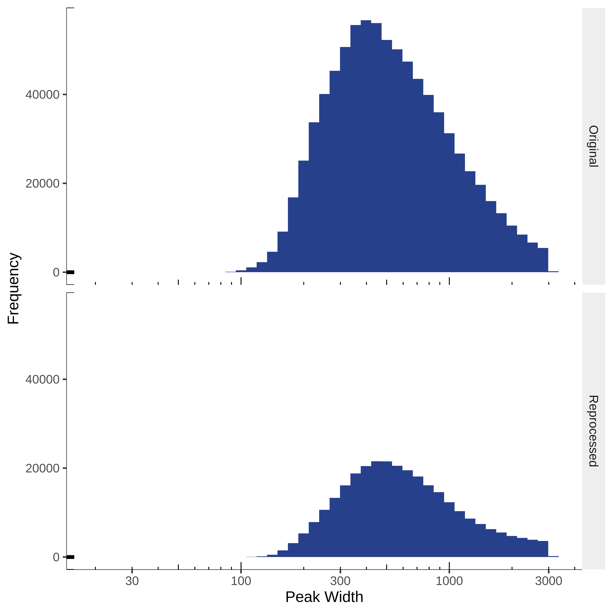
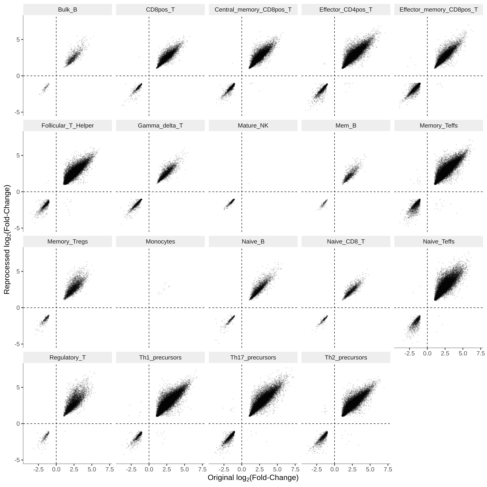

# Immune and Neutrophil Atlases

## Datasets Included

1. [Calderon *et al.* 2019](https://doi.org/10.1038/s41588-019-0505-9)
2. [Ram-Mohan *et al.* 2021](https://doi.org/10.26508/lsa.202000976)

## Calderon *et al.* 2019

The Calderon *et al.* study generated an atlas of transcriptomic and chromatin
accessibility data for primary immune cell types in the blood under both
unstimulated and stimulated conditions.

While 147 of the 166 RNA-Seq samples were run on an Illumina NovaSeq 6000
sequencer with 100 bp paired-end reads, 19 samples were run on an Illumina 
HiSeq 4000 sequencer with 76 bp paired-end reads.

Although there are 25 cell types present in the RNA-Seq samples, only 21 cell
types have at least three samples (necessary for statistical tests).

Of the 8 donors for RNA-Seq samples, 4 made outsized contributions.

In the ATAC-Seq data, in contrast, 159 of the 175 samples were run on an
Illumina HiSeq 4000 sequencer and 16 samples were run on an Illumina NovaSeq
6000 sequencer. All sequenced samples generated 76 bp paired-end reads.

Similar to the RNA-Seq data, 4 of the 7 sample donors made outsized
contributions to the ATAC-Seq data.

| Covariate  | RNA-Seq | ATAC-Seq |
|:-----------|--------:|---------:|
| Donor      | 8       | 7        |
| Treatments | 2       | 2        |
| Lineages   | 6       | 6        |
| Cell Types | 25      | 25       |
| Sequencers | 2       | 2        |
| Reads      | Paired  | Paired   |
| Samples    | 166     | 175      |

**Note**: DCs are dendritic cells. pDCs are Plasmacytoid DCs.

| Lineage | Cell Type                | RNA-Seq Samples | ATAC-Seq Samples|
|:--------|:-------------------------|----------------:|----------------:|
| B       | Bulk_B                   | 7               | 7               |
| B       | Mem_B                    | 7               | 8               |
| B       | Naive_B                  | 8               | 7               |
| B       | Plasmoblasts             | 1               | 3               |
| CD8     | CD8pos_T                 | 8               | 7               |
| CD8     | Central_memory_CD8pos_T  | 7               | 8               |
| CD8     | Effector_memory_CD8pos_T | 8               | 8               |
| CD8     | Naive_CD8_T              | 8               | 8               |
| GD      | Gamma_delta_T            | 7               | 7               |
| CD4     | Effector_CD4pos_T        | 8               | 7               |
| CD4     | Follicular_T_Helper      | 8               | 9               |
| CD4     | Memory_Teffs             | 8               | 8               |
| CD4     | Memory_Tregs             | 7               | 8               |
| CD4     | Naive_Teffs              | 10              | 9               |
| CD4     | Regulatory_T             | 7               | 8               |
| CD4     | Th1_precursors           | 8               | 8               |
| CD4     | Th17_precursors          | 8               | 7               |
| CD4     | Th2_precursors           | 8               | 8               |
| CD4     | Naive_Tregs              | 5               | 4               |
| NK      | Immature_NK              | 1               | 5               |
| NK      | Mature_NK                | 10              | 10              |
| NK      | Memory_NK                | 1               | 6               |
| MYELOID | Monocytes                | 12              | 9               |
| MYELOID | Myeloid_DCs              | 3               | 3               |
| MYELOID | pDCs                     | 1               | 3               |

Additional data for monocytes was supplemented from the Corces *et al.* study.
This data included 6 ATAC-Seq samples and 4 RNA-Seq samples from unstimulated
monocytes.

## Ram-Mohan *et al.* 2021

The Ram-Mohan *et al.* study generated an atlas of neutrophil chromatin
accessibility and transcriptomic data under a broad range of sepsis-relevant
stimulations.

In the ATAC-Seq data, all samples were run on an Illumina HiSeq X Ten
sequencer. All sequenced samples generated 150 bp paired-end reads.

There are 76 total ATAC-Seq samples. Each biological replicate has two
technical replicates, resulting in 38 total biological replicates.

There are three parts to the study:

1. *Ex vivo* stimulation of neutrophils with known ligands
2. Whole organism stimulation of neutrophils with varying concentrations of
    *Staphylococcus aureus*
3. Whole organism stimulation of neutrophils for varying time points with
    *Escherichia coli*

**Ex Vivo Stimulation**

The investigators used six stimulations:

| Type of Infection      | Ligand | Receptor  |
|:-----------------------|:-------|:----------|
| Gram + (*S. aureus*)   | LTA    | TLR2      |
| Gram - (*E. coli*)     | LPS    | TLR4      |
| Gram + or -            | FLAG   | TLR5      |
| ssRNA (Influenza, RSV) | R848   | TLR7/TLR8 |
| Fungal (*Candida*)     | BGP    | Dectin-1  |
| Sterile Inflammation   | HMGB1  | TLR4/?    |

The investigators also included control samples. There were a total of four
donors across these six stimulations. Thus, 28 of the 38 samples are from this
experiment.

**S. aureus Stimulation**

The investigators used 10E1, 10E3, and 10E5 *S. aureus* cells as stimulation.
Only 10E3 had two donors, with one donor for 10E1 and 10E5. Both donors also
provided control samples. Thus, 6 of the 38 samples are from this experiment.

**E. coli Stimulation**

The investigators performed ATAC-Seq 1 hour and 4 hours after stimulation with
*E. coli*. Time-matched control samples were also acquired. Only one donor
contributed to this experiment. Thus, 4 of the 38 samples are from this
experiment.

## Quality Control

### RNA-Seq

1. FASTQ files were downloaded from SRA in paired-end mode
2. Adapter contamination from sequencing was removed using TrimGalore
3. Initial QC was performed

I used RNASeQC to quantify various metrics from the Immune Atlas samples. Three particularly interesting metrics were:

1. Mapped Reads - the number of reads that mapped successfully from the sample
2. Proportion of Low Quality Reads - I believe this is defined by RNASeQC as MAPQ < 4
3. Intronic Rate - the proportion of reads that mapped to the intron

Most samples had a good number of mapped reads. There was one sample with very low mapping read counts in the CD4 lineage, which was discarded when identify DE genes.

There was some variation across samples, but all samples had less than 15% low quality reads. This could be used as a covariate to control for noise.

Generally, a low intronic rate suggests that most of the mRNA is coming from mature transcripts. There is a donor-specific effect here (donors 1009, 1010, and 1011 from the Calderon study have high intronic rates).

### ATAC-Seq

1. FASTQ files were downloaded from SRA in paired-end mode
2. Adapter contamination from sequencing was removed from FASTQ files using TrimGalore
3. Initial QC was performed on samples

One method we used to assess the quality of samples was by measuring the 
fraction of reads in peaks (FRiP). Briefly, peaks were called using the MACS2
software. We created a consensus peak set from the individual peak sets called
for each sample. The FRiP in the consensus peaks was, on average, higher than that for each sample's MACS2 peaks.

We could not discern any strong donor- or lineage-specific quality issues from the FRiP scores.

The authors of the study used TSS Enrichment Scores as a proxy for sample quality. An advantage of this score is that it is independent of the peaks set
used in the final analysis. I calculated this score for our samples.

Some donors do seem to produce better quality ATAC-Seq data. Samples from the monocyte lineage seem to suffer from quality issues in general.

The original count matrix and set of DA peaks from the original Calderon et al. 2019 study were retrieved from the GEO entry for the study (GSE118189) and the supplementary information of the publication respectively. Peak intervals from the original study were converted from hg19 coordinates to GRCh38 coordinates using the `liftOver` function in the rtracklayer R package (Lawrence et al. 2009). Peaks that were split during the conversion were discarded. The `findOverlaps` function in the GenomicRanges R package (Lawrence et al. 2013) was used to identify peaks from this analysis that overlapped peaks from the original study. Overlapping pairs of DA peaks were used to compare direction and size of effects across the analyses.

ATAC-seq alignment and peak calling was similar between this analysis and the initial analysis of the data (Calderon et al. 2019). The consensus peak set in this analysis was built by merging cell-type-specific peak sets and used a more stringent criteria for merging peaks across samples. Furthermore, this analysis utilised fewer cell types than the original analysis. Unsurprisingly, the consensus peak set in this analysis contained fewer peaks (296,994 peaks) than the original analysis (827,922 peaks). Although the median width of peaks in this analysis (554 base pairs) was slightly larger than the original analysis (490 base pairs), the overall distribution of peak sizes was comparable between the two analyses. 

The distribution of peaks across the genome was also comparable between the two analyses.

Although reads were aligned to different peak sets and genome builds, read counts were highly concordant between overlapping peaks across the two analyses.

Overlapping DA peaks between the two analyses had consistent directions of effect and comparable effect sizes.

## Data Processing

### RNA-Seq

#### Alignment

Adapter sequences were trimmed using [TrimGalore](https://github.com/FelixKrueger/TrimGalore) with the `--paired` option. The reads were then aligned to the GRCh38 build of the human genome using STAR (Dobin et al. 2013) with default parameters and `--outFilterMultimapNmax` set to 20. Duplicates were marked using the [Picard](https://github.com/broadinstitute/picard) `MarkDuplicates` function. The alignment files were indexed and sorted using SAMtools (Danecek et al. 2021). The number of fragments that fell into exonic regions of genes in version 99 of the Ensembl human genome reference (Yates et al. 2020) were counted using featureCounts (Liao et al. 2014) with `-t exon`, `-g gene_id`, and `-p`. Quality control metrics, such as the number of mapped reads, proportion of low quality mapping reads, and intronic rate were calculated using RNA-SeQC (Graubert et al. 2021).

#### DE Genes

The RNA-seq count matrix from the immune atlas was processed using edgeR (Robinson et al. 2010). A sample of unstimulated effector CD4+ T cells was removed due to low total read count ($<10^7$). As in the original analysis (Calderon et al. 2019), only protein coding genes were included (Ensembl "Protein Coding", "IG Gene", and "TR Gene" gene biotypes). After excluding non-protein-coding genes from the original 60,676 genes, 20,376 genes were used to build a count matrix. Genes were filtered using the `filterByExpr` function using the cell type and stimulation status as groups, a minimum count of 50, a minimum total count of 200, and a minimum proportion of 1. This resulted in 17,258 expressed genes. Normalisation factors for each gene were calculated using the weighted trimmed mean of M-values method. The mean-variance relationship of gene expression was modelled using voom (Law et al. 2014). DE genes were identified using limma (Ritchie et al. 2015) by implementing contrasts to compare stimulated and unstimulated samples from each cell type. The donor was included as a covariate in the model. A DE gene was defined as any gene with an absolute $\log_2$ fold change of greater than 1 and an adjusted p-value of less than 0.01.

### ATAC-Seq

#### Alignment

Adapter sequences were trimmed using [TrimGalore](https://github.com/FelixKrueger/TrimGalore) with the `--paired` option. The reads were then aligned to the Genome Reference Consortium human build 38 (GRCh38) build of the human genome using Bowtie 2 (Langmead et al. 2012) with default parameters and `--no-mixed` and `--no-discordant` flags set. Duplicates were marked using the [Picard](https://github.com/broadinstitute/picard) `MarkDuplicates` function. Reads that were unpaired, unmapped, duplicates, or mapped to multiple locations were filtered out. To ensure quality alignments, reads with a mapping quality (MAPQ) score of less than 30 were filtered out. Reads that mapped to the mitochondrial genome or to the blacklisted genomic regions reported by the Encyclopedia of DNA Elements (ENCODE) (Amemiya et al. 2019) were also filtered out. Technical replicates from the neutrophil atlas were merged. The alignment files were filtered, indexed, merged, and sorted using a combination of SAMtools (Danecek et al. 2021) and BEDTools (Quinlan et al. 2010).

### Sample Quality

TSS enrichment scores were used as a proxy for sample quality. TSS enrichment scores measure the signal-to-noise ratio for each sample based on the expectation that regions near the TSS of protein-coding genes are more accessible across the entire genome. The score was calculated by dividing the mean coverage of the 100 base pair regions centred at the TSS by the mean coverage of the 100 base pair regions that are 1 Mb away from the TSS. TSS regions of protein coding genes were retrieved from version 99 of the Ensembl human genome reference (Yates et al. 2020) and coverage was calculated using featureCounts (Liao et al. 2014) with `-p` and `-O`.

### Peaks

ATAC-seq peaks were called using MACS2 (Zhang et al. 2008) with `--keep-dup all`, `--nomodel`, `--nolambda`, and `-f BAMPE`. Three types of peak sets were defined: group, cell type, and consensus peak sets. A group was defined as a cell-condition pair, where the condition was stimulation status (stimulated versus unstimulated) for the immune atlas and stimulation condition (ligand, E. coli + time point, or S. aureus + concentration) for the neutrophil atlas. For each group, sample peaks with MACS2-derived q-value less than 1 × 10−4 present in two or more samples were merged. If the group consisted of only one sample, only the q-value filter was applied. Any peaks larger than 3 kilobases (kb) were removed.

The group peak sets were used to create the cell type peak sets. For each group peak set, peaks that intersected with peaks from another group peak set from the same cell type with less than 90% overlap were filtered out. Group peak sets from the same cell type were then merged. Any peaks larger than 3 kb were removed.

All group peak sets in an atlas were used to create the consensus peak set. Peaks that intersected with peaks from another group with less than 90% overlap were filtered out before merging group peak sets. Any peaks larger than 3 kb were removed. Intersection and merging operations were performed using BEDTools (Quinlan et al. 2010).

### Peak Annotation and Motif Enrichment

To characterise ATAC-seq peaks detected in various cell types and under various stimulations, peak sets were annotated using the `annotatePeaks.pl` script in HOMER (Heinz et al. 2010). The script was run with the GRCh38 build of the human genome, genome annotation from version 99 of the Ensembl human genome reference (Yates et al. 2020), and the `-organism human` option.

Motif enrichment analysis requires an appropriate background set of sequences to contrast with the query sequences of interest. Since ATAC-seq peaks are enriched near the TSS, background sequences were selected in a local region around the test peak set. For the cell type peaks, the flanking regions upstream and downstream of each peak were used as background sequences. Any flanking region that overlapped with another peak in the test set was removed from the background sequence set. For the group peaks discovered under stimulation, the background sequences were defined as any peaks that overlapped more than 90% between the control and the stimulated group peak sets. The test set was constructed by removing any peaks from the stimulated group peak set that overlapped with any peak from the control group peak set.

Simple enrichment analysis (SEA) implemented in the MEME suite (Bailey et al. 2015; Bailey et al. 2021) was used to identify enrichment of known motifs in peaks compared to the defined background set of sequences. Only motifs with an enrichment q-value less than 0.05 were retained. The find individual motif occurrences (FIMO) tool in the MEME suite (Grant et al. 2011; Bailey et al.2015) was used to identify motif locations in peak sequences. Curated, non-redundant transcription factor binding motifs were retrieved from the vertebrate taxonomic group of the JASPAR 2022 CORE database (Sandelin et al. 2004; Castro-Mondragon et al. 2022).

#### DA Peaks

The ATAC-seq count matrices from the immune atlas and neutrophil atlas were processed using edgeR (Robinson et al. 2010). Nine samples with TSS enrichment scores of up to 6 were excluded from the immune atlas and 13 samples with TSS enrichment scores of up to 4 were excluded from the neutrophil atlas. Peaks were filtered using the `filterByExpr` function using the cell type and stimulation status as groups, a minimum count of 50, a minimum total count of 200, and a minimum proportion of 1. Of the 296,996 peaks from the immune atlas, 261,063 peaks were tested after the filtering step. Of the 140,923 peaks from the neutrophil atlas, 65,148 were tested after the filtering step. Normalisation factors for each gene were calculated using the weighted trimmed mean of M-values method. The mean-variance relationship was modelled using voom (Law et al. 2014). DA peaks were identified using limma (RIthcie et al. 2015) by implementing contrasts to compare stimulated and unstimulated samples from each cell type in the immune atlas. In the neutrophil atlas, each *ex vivo* stimulation was contrasted with controls. For the *E. coli* stimulation, the stimulated conditions were contrasted against the control conditions at their respective time points. A DA peak was defined as any peak with an absolute $\log_2$ fold change of greater than 1 and an adjusted p-value of less than 0.01.

